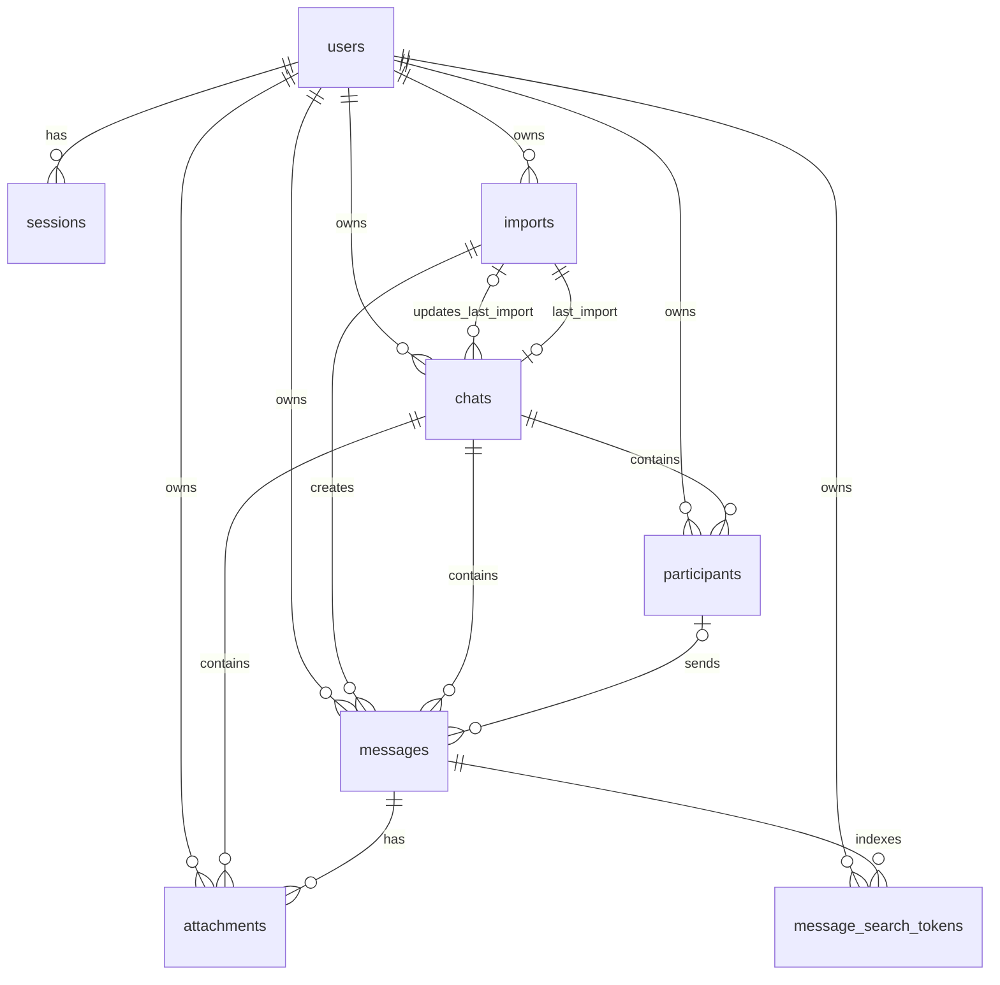

# Database Schema

This document explains the relational model used by `ownwa`. The canonical schema lives in `apps/server/src/lib.ts` as `schemaSql`, and migrations are applied by `runMigrations()`.

## Schema Goals

The schema is designed to support:

- per-user isolation
- reliable import tracking
- deduplicated chat history ingestion
- attachment reuse
- efficient timeline reads
- search without storing raw query tokens

## Entity Relationship Overview

## Table By Table

## `users`

Purpose:

- stores account identity and user-level import settings

Columns:

- `id`: text primary key
- `username`: unique normalized username
- `password_hash`: Argon2id password hash
- `self_display_name`: optional WhatsApp self-name used to classify outgoing messages
- `created_at`: account creation timestamp

Notes:

- `self_display_name` is the only user profile field today.
- imports use this value when deciding whether a parsed message should be marked `is_me`.

## `sessions`

Purpose:

- stores authenticated browser sessions

Columns:

- `id`: text primary key
- `user_id`: foreign key to `users`
- `token_hash`: HMAC of the opaque session token, unique
- `expires_at`: session expiry timestamp
- `created_at`: creation timestamp
- `last_seen_at`: activity timestamp

Notes:

- the raw session token is sent as an HTTP-only cookie
- only the hashed token is stored in the database
- deleting a user cascades to their sessions

## `imports`

Purpose:

- tracks each uploaded WhatsApp export from queueing through completion or failure

Columns:

- `id`: text primary key
- `owner_id`: foreign key to `users`
- `status`: import lifecycle state, such as `pending`, `processing`, `completed`, or `failed`
- `file_name`: original uploaded filename
- `file_sha256`: SHA-256 of the source archive, used for import deduplication
- `source_blob_key`: blob storage key for the encrypted original upload
- `source_blob_storage`: blob backend kind, `local` or `s3`
- `source_blob_metadata`: serialized pointer metadata for blob retrieval
- `source_size`: archive size in bytes
- `source_chat_title`: best derived chat title from the import
- `normalized_chat_title`: normalized title for lookup/upsert logic
- `import_options`: serialized options used during parsing, currently including `selfDisplayName`
- `progress_state`: serialized progress object with task label and percentage
- `parse_summary`: serialized summary of parsed results
- `error_message`: failure reason when processing fails
- `created_at`: creation timestamp
- `updated_at`: last state update timestamp
- `completed_at`: completion or terminal failure timestamp

Constraints:

- `UNIQUE(owner_id, file_sha256)`

Why this matters:

- a user cannot import the exact same export twice
- imports remain fully owner-scoped
- the original encrypted upload can be retried without re-uploading the file

## `chats`

Purpose:

- stores the logical conversation list shown in the archive UI

Columns:

- `id`: text primary key
- `owner_id`: foreign key to `users`
- `source_title`: latest title derived from imported data
- `display_title`: current UI title, user-editable
- `title_overridden`: whether `display_title` should stop auto-following `source_title`
- `normalized_title`: normalized conversation key used for upsert/dedup
- `last_import_id`: nullable foreign key to `imports`
- `created_at`: creation timestamp
- `updated_at`: last update timestamp

Constraints:

- `UNIQUE(owner_id, normalized_title)`

Notes:

- overlapping imports for the same conversation merge into the same chat row
- if the user has manually renamed a chat, later imports update `source_title` but preserve `display_title`

## `participants`

Purpose:

- stores distinct senders seen within a chat

Columns:

- `id`: text primary key
- `owner_id`: foreign key to `users`
- `chat_id`: foreign key to `chats`
- `display_name`: most recent sender display name
- `normalized_name`: normalized sender key
- `created_at`: creation timestamp

Constraints:

- `UNIQUE(chat_id, normalized_name)`

Notes:

- participant rows are created lazily during import
- messages can reference a participant through `sender_participant_id`

## `messages`

Purpose:

- stores normalized transcript rows

Columns:

- `id`: text primary key
- `owner_id`: foreign key to `users`
- `chat_id`: foreign key to `chats`
- `import_id`: foreign key to `imports`
- `sender_participant_id`: nullable foreign key to `participants`
- `sender_name`: original sender label as presented in the parsed archive
- `normalized_sender_name`: normalized sender label
- `message_timestamp`: parsed timestamp when available
- `original_timestamp_label`: raw timestamp text from the transcript
- `body_encrypted`: encrypted message body
- `is_me`: whether the row belongs to the current user
- `has_attachments`: quick flag for attachment existence
- `message_kind`: `message` or `event`
- `event_type`: nullable subtype for system/call events
- `message_fingerprint`: deterministic deduplication key
- `created_at`: creation timestamp

Constraints:

- `UNIQUE(chat_id, message_fingerprint)`

Why the fingerprint exists:

- re-importing overlapping exports does not duplicate existing messages
- message identity is determined by normalized content, sender, timestamp label, and attachment shape rather than upload order

## `attachments`

Purpose:

- stores per-message attachment metadata and blob references

Columns:

- `id`: text primary key
- `owner_id`: foreign key to `users`
- `chat_id`: foreign key to `chats`
- `message_id`: foreign key to `messages`
- `file_name`: original attachment file name
- `normalized_name`: normalized file name
- `mime_type`: detected mime type when known
- `byte_size`: attachment size
- `content_sha256`: optional content hash for blob deduplication
- `storage_driver`: blob backend kind when content exists
- `blob_key`: blob key when content exists
- `blob_metadata`: serialized pointer metadata
- `placeholder_text`: fallback text when the transcript references a file but the export does not include the blob
- `attachment_fingerprint`: deterministic attachment identity within a message
- `created_at`: creation timestamp

Constraints:

- `UNIQUE(message_id, attachment_fingerprint)`

Notes:

- a message can have multiple attachments
- multiple attachment rows can point at the same underlying encrypted blob when content hashes match
- attachments without payloads are still represented as placeholder rows

## `message_search_tokens`

Purpose:

- stores hashed search terms for search lookup

Columns:

- `message_id`: foreign key to `messages`
- `owner_id`: foreign key to `users`
- `chat_id`: foreign key to `chats`
- `token_hash`: HMAC of a normalized token
- `created_at`: creation timestamp

Primary key:

- `(message_id, token_hash)`

Why this design is used:

- the app can search messages without storing raw searchable tokens
- owner and chat scoping are built into the index rows

## Relationships And Ownership Rules

Ownership is enforced in two ways:

- every user-facing content table carries `owner_id`
- application queries always filter by `owner_id`

This is important because chats, messages, attachments, and search rows are not globally shared, even when file names or hashes happen to match across users.

## Important Indexes

The schema includes several targeted indexes:

- `idx_sessions_user_id`: session cleanup and lookup support
- `idx_imports_owner_status`: queue and history listing by owner/status
- `idx_chats_owner_updated`: archive sidebar ordering
- `idx_messages_chat_timestamp`: transcript reads ordered by timeline
- `idx_messages_owner_import`: import-scoped message lookup
- `idx_attachments_owner_sha`: attachment content deduplication
- `idx_search_tokens_lookup`: chat-scoped search lookup
- `idx_search_tokens_owner_lookup`: global search lookup

## Serialized JSON/Text Columns

Several columns intentionally store serialized JSON as text rather than fully normalized sub-tables.

These include:

- `imports.import_options`
- `imports.progress_state`
- `imports.parse_summary`
- `imports.source_blob_metadata`
- `attachments.blob_metadata`

Why:

- these structures are write-heavy and relatively small
- they are not the primary query surface
- keeping them inline simplifies the schema while preserving flexibility for evolving metadata

## Import Lifecycle Through The Schema

An import usually touches the tables in this order:

1. `imports` row is created with `pending`
2. worker claims the row and moves it to `processing`
3. `chats` is upserted
4. `participants` is upserted as needed
5. `messages` rows are inserted if fingerprints are new
6. `message_search_tokens` rows are inserted for newly inserted messages
7. `attachments` rows are inserted, with blob reuse when possible
8. `imports` is finalized with `completed` plus summary data
9. `chats.last_import_id` is updated to the finished import

If processing fails:

- `imports.status` becomes `failed`
- `imports.error_message` is set
- source blob remains in storage so a retry can reuse it

## Deduplication Rules

The schema supports deduplication at three layers.

### Import deduplication

- based on `imports.file_sha256`
- scoped by `owner_id`

### Message deduplication

- based on `messages.message_fingerprint`
- scoped by `chat_id`

### Attachment blob deduplication

- based on `attachments.content_sha256`
- scoped by `owner_id`
- blob reuse is allowed across multiple messages

## Migration Behavior

Schema initialization and forward-compatible column creation happen in `runMigrations()`.

That function:

- executes `schemaSql`
- adds newer columns with `ALTER TABLE ... ADD COLUMN IF NOT EXISTS`
- upgrades a few column types
- creates missing indexes
- backfills some chat title fields

This keeps local development and lightweight deployments easy to start without a separate migration framework.

## Practical Read Patterns

Typical reads in the application look like this:

- archive sidebar: `chats` ordered by `updated_at`
- chat transcript: `messages` by `chat_id`, ordered by timestamp and creation order
- attachments for visible messages: `attachments` by `message_id`
- search: `message_search_tokens` lookup, then fetch matching `messages`
- import status: `imports` list or single import detail by `owner_id`

## Summary

The schema is intentionally compact. It focuses on a few high-value guarantees:

- every row belongs to one owner
- import retries are possible without re-upload
- overlapping imports do not duplicate messages
- attachments can reuse stored blobs
- search is fast enough for the app without storing plaintext tokens

That balance is what makes the schema practical for a self-hosted archive tool rather than a generalized messaging platform.
