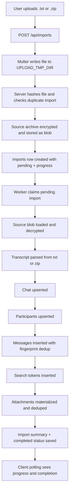

# Import And Processing Pipeline

This document explains the full ingestion path in `ownwa`, from upload to searchable archive rows.

The canonical implementation lives in:

- `apps/server/src/app.ts` for HTTP upload handling
- `apps/server/src/lib.ts` for import creation, parsing, storage, deduplication, and worker execution

## End-To-End Flow

## Pipeline Goals

The pipeline is designed to guarantee:

- owner isolation
- encrypted storage at rest
- retryability
- deduplication across repeated or overlapping imports
- support for both small and very large exports

## Stage 1: Upload Request

Entry point:

- `POST /api/imports` in `apps/server/src/app.ts`

What happens:

1. the route requires authentication
2. Multer accepts one uploaded file and writes it to `UPLOAD_TMP_DIR`
3. the server loads the user’s `selfDisplayName`
4. `ArchiveServices.createImportFromFile()` is called

Important behavior:

- uploads are disk-backed, not memory-backed
- the route enforces `MAX_IMPORT_BYTES`
- the upload temp file is cleaned up after the request path completes

## Stage 2: Import Record Creation

Implementation:

- `ArchiveServices.createImportFromFile()`

What happens:

1. the uploaded file is hashed with SHA-256
2. the server checks `imports` for an existing `(owner_id, file_sha256)` match
3. if a duplicate exists, import creation is rejected
4. if not, the source archive is encrypted and written to blob storage
5. an `imports` row is inserted with:
   - `status = pending`
   - file metadata
   - source blob pointer
   - import options
   - initial progress state of `Queued / 0%`
6. the worker is kicked so processing can start promptly

Why this stage exists:

- the original source is preserved for retries
- processing can fail without losing the uploaded archive
- the UI can show queue state immediately after upload

## Stage 3: Source Blob Storage

The original uploaded export is never treated as durable plaintext storage.

What happens:

- the archive is encrypted before being stored
- the encrypted payload is written either to:
  - the local filesystem under `BLOB_ROOT`
  - an S3-compatible object store

Why source blobs are kept:

- retries do not require the user to re-upload the export
- the system has a stable source of truth for future reprocessing

## Stage 4: Worker Claiming

Implementation:

- `ArchiveServices.startWorker()`
- `ArchiveServices.processPendingImports()`

How it works:

- the server process runs a polling worker
- each cycle looks for one `pending` import
- claiming an import updates it to `processing`
- the claim also initializes progress to an early stage such as `Preparing import / 2%`

Why this is safe enough for the current design:

- the state change happens in SQL, so only claimed rows move forward
- the app assumes a simple self-hosted deployment model rather than a large distributed queue

## Stage 5: Source Loading And Decryption

Implementation:

- `ArchiveServices.processImport()`

The worker has two data paths.

### Small and medium imports

For imports at or below the large-file threshold:

1. the encrypted source blob is read into memory
2. the blob is decrypted in memory
3. the parser consumes the resulting buffer

### Very large imports

For imports larger than 2 GB:

1. the encrypted source blob is streamed to a temp file
2. the encrypted temp file is decrypted to another temp file
3. the parser works from the decrypted file path

Why there are two paths:

- small imports are simpler to parse in memory
- very large imports should avoid full in-memory expansion

## Stage 6: Transcript Parsing

Primary parsing functions:

- `parseWhatsAppArchive()`
- `parseWhatsAppArchiveFile()`
- `parseTranscriptInput()`

Supported input forms:

- raw `.txt` export
- `.zip` export with a WhatsApp transcript file and optional media files

What the parser extracts:

- transcript name
- derived chat title
- normalized chat title
- message rows
- sender labels
- timestamps
- event/call rows
- attachment references
- whether media is present

### `.zip` parsing behavior

When a zip is uploaded:

- the code finds the main transcript `.txt`
- all non-skippable sibling entries are treated as possible attachments
- attachment metadata is keyed by normalized filename

### Message classification

For each parsed row, the parser determines:

- sender name
- whether it is a normal message or event row
- whether it should be marked `isMe`
- whether attachment placeholders or real attachment payloads should be attached

### Chat title derivation

The parser attempts to infer a human-readable chat title from the upload file name or transcript file name, including common WhatsApp export naming patterns such as:

- `WhatsApp Chat with Alex.zip`
- `WhatsApp Chat - Project Room.zip`
- `Chat with Alex.txt`

## Stage 7: Transactional Persistence

Once parsing succeeds, the worker opens a DB transaction.

This stage is intentionally transactional so that partial imports do not leave inconsistent normalized rows behind.

The worker then persists data in the following order.

## Stage 7.1: Chat upsert

Implementation:

- `upsertChat()`

Behavior:

- inserts a new chat if this normalized title has never been seen for the owner
- otherwise updates the existing chat
- preserves `display_title` if the user has manually renamed the chat
- sets `last_import_id` to the current import

## Stage 7.2: Participant upsert

Implementation:

- `upsertParticipant()`

Behavior:

- one participant row per normalized sender per chat
- cached in-memory during the import to avoid repeated DB lookups

## Stage 7.3: Message insert with deduplication

Implementation:

- `buildMessageFingerprint()`
- `INSERT ... ON CONFLICT (chat_id, message_fingerprint) DO NOTHING`

Behavior:

- each parsed message is fingerprinted
- if the fingerprint is new, a message row is inserted
- if the fingerprint already exists, the worker reuses the existing message row

Why this matters:

- overlapping exports do not duplicate history
- partial re-imports are safe
- the archive can grow incrementally from multiple exports of the same chat

## Stage 7.4: Search token indexing

Implementation:

- `tokeniseForSearch()`
- `message_search_tokens`

Behavior:

- only newly inserted messages are indexed
- message content is tokenized
- each token is HMAC-hashed with the session secret
- hashed tokens are inserted into `message_search_tokens`

Why it works this way:

- search remains fast enough for the app
- raw search terms are not stored in the DB

## Stage 7.5: Attachment materialization

Implementation:

- `materialiseAttachment()`
- `buildAttachmentFingerprint()`

Two important cases exist.

### Attachment exists in the export

If the export includes the actual file content:

1. the worker loads or reads the attachment bytes
2. it computes `content_sha256`
3. it checks whether this owner already has a stored blob with the same content hash
4. if yes, it reuses the existing blob pointer
5. if not, it encrypts the bytes and stores a new blob

### Attachment is only referenced in transcript text

If the transcript mentions a file but the export does not include the payload:

- the app still creates an attachment row
- blob fields remain null
- `placeholder_text` preserves what the UI should display

Why this distinction matters:

- exported transcripts are often incomplete
- the UI can still represent the attachment even when the file body is missing

## Stage 8: Finalization

After all rows are processed:

1. `chats.last_import_id` is updated
2. the import row is updated to `completed`
3. `parse_summary` is written
4. progress becomes `Completed / 100%`
5. the transaction is committed

The parse summary includes:

- transcript name
- total messages parsed
- total new messages inserted
- attachments linked
- attachments physically stored
- participant count
- whether the archive included media

## Progress Reporting

The import worker writes progress updates back to the `imports.progress_state` column.

Typical stages include:

- `Queued`
- `Preparing import`
- `Loading source`
- `Downloading source`
- `Decrypting source`
- `Parsing archive`
- `Preparing records`
- `Saving messages`
- `Finalizing import`
- `Completed`

Progress writes are intentionally throttled:

- task changes are always persisted
- percentage-only changes are persisted only when they move by a configurable minimum step
- the minimum step is controlled by `IMPORT_PROGRESS_STEP_PERCENT`

This reduces unnecessary database churn on large imports while keeping the UI responsive.

The client already polls import endpoints, so progress reporting is implemented without websockets:

- the import modal shows recent import progress
- the import detail page shows the active stage and percent complete

## Failure Handling

If any step throws during worker processing:

1. the DB transaction is rolled back
2. the import is marked `failed`
3. `error_message` is saved
4. progress changes to `Import failed / 0%`

What does not happen on failure:

- the encrypted source blob is not deleted automatically

Why:

- the user can retry the import without uploading again

## Retry Flow

Entry point:

- `POST /api/imports/:id/retry`

What retry does:

- verifies the import belongs to the current user
- only allows retry when the import is `failed`
- clears the error state
- resets summary and completion fields
- resets progress to `Queued / 0%`
- keeps the stored encrypted source blob
- re-enqueues the import

## Clear Flow

Entry point:

- `DELETE /api/imports/:id`

What clear does:

- only works for failed imports
- deletes the encrypted stored source blob
- deletes the import row

This is intentionally separate from retry so users can choose between trying again or fully discarding a bad import.

## Temporary Files And Cleanup

Temporary disk usage appears in two places:

- Multer writes the initial uploaded file to `UPLOAD_TMP_DIR`
- large-import processing creates temp working directories for encrypted/decrypted files

Cleanup behavior:

- request temp files are cleaned after the upload handler finishes
- large-import temp directories are removed in worker cleanup

## Performance Characteristics

The current pipeline is optimized for correctness and self-hosted simplicity more than raw throughput.

Strengths:

- good support for moderate and large single-user imports
- reliable overlap deduplication
- no external queue dependency
- retryable failure model
- configurable worker interval, batch size, large-file threshold, and progress persistence granularity

Tradeoffs:

- processing is sequential inside the server process
- per-message inserts are explicit rather than batched into large bulk loaders
- very large archives still involve significant disk I/O and DB work

## Practical Debugging Guide

When imports behave unexpectedly, the most important places to inspect are:

- `imports.status`
- `imports.progress_state`
- `imports.error_message`
- `imports.parse_summary`

Common failure classes:

- zip file missing a transcript `.txt`
- malformed or unsupported transcript structure
- blob storage misconfiguration
- encryption key misconfiguration
- DB write failure during transactional persistence

## Summary

The import pipeline in `ownwa` is built around a simple principle:

- keep the original archive encrypted and retryable
- normalize transcript data into relational rows
- deduplicate aggressively
- expose progress clearly to the UI

That makes imports predictable for users and keeps the internals understandable for developers working on the app.
